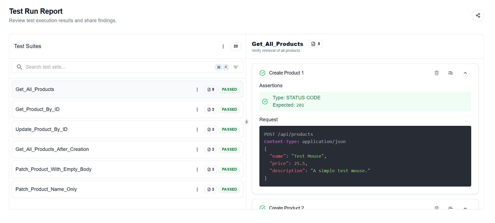

# 🛒 Product API – CRUD Application with Testing

This is a simple Node.js + Express REST API for managing products, built with MongoDB and Mongoose. 

---

### 📸 Successful Test Suite Screenshot using Keploy Testing Platform

---

## 🔗 API Overview

The following endpoints are available:

| Method | Endpoint                | Description             |
|--------|-------------------------|-------------------------|
| GET    | `/api/products`         | Get all products        |
| GET    | `/api/products/:id`     | Get product by ID       |
| POST   | `/api/products`         | Create a new product    |
| PATCH  | `/api/products/:id`     | Update an existing one  |
| DELETE | `/api/products/:id`     | Delete a product        |

---
