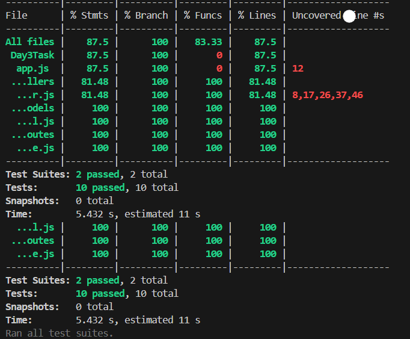

# 🛒 Product API – CRUD Application with Testing

This is a simple Node.js + Express REST API for managing products, built with MongoDB and Mongoose. 

---

## 🔗 API Overview

The following endpoints are available:

| Method | Endpoint                | Description             |
|--------|-------------------------|-------------------------|
| GET    | `/api/products`         | Get all products        |
| GET    | `/api/products/:id`     | Get product by ID       |
| POST   | `/api/products`         | Create a new product    |
| PATCH  | `/api/products/:id`     | Update an existing one  |
| DELETE | `/api/products/:id`     | Delete a product        |

---

## ⚙️ Tech Stack

- **Backend Framework:** Express.js
- **Database:** MongoDB (with Mongoose ODM)
- **Testing Framework:** Jest
- **Test Runner:** Supertest
- **In-Memory DB for Tests:** mongodb-memory-server
- **Dev Tools:** Nodemon, Cross-env

---

## 🚀 Getting Started

### 📦 Install Dependencies

```bash
npm install
```

### 🧪 Run Tests

```bash
npm test
```

This runs:
- ✅ **Unit tests** (controller-level with Jest and Mocks)
- ✅ **Integration/API tests** (using Supertest + MongoDB Memory Server)

To see test coverage:
```bash
npm test
```

---

## 🧪 Testing Tools & Approach

| Layer            | Tool(s) Used                  | Notes                                     |
|------------------|-------------------------------|-------------------------------------------|
| Unit Tests       | Jest                          | Model methods mocked using `jest.mock()`  |
| Integration Tests| Supertest + MongoDB Memory    | Full request-response flow, real DB logic |
| Code Coverage    | Jest `--coverage` flag        | Coverage report auto-generated            |

---

## ✅ Test Coverage Snapshot

> Achieved **87.5%+** coverage on all major metrics including statements, branches, functions, and lines.

### 📸 Coverage Screenshot



---

## 💡 How to Start the Server

```bash
npm run dev   # for development (with nodemon)
npm start     # to start normally
```

Server will run on default `http://localhost:5000` (or set via `.env`)

---

## 📁 Project Structure

```
├── controllers/
│   └── productController.js
├── models/
│   └── product.model.js
├── routes/
│   └── product.route.js
├── tests/
│   └── productController.test.js
├── app.js
├── server.js
├── package.json
└── README.md
```

---

## 🧊 Environment Variables

Create a `.env` file in the root:

```
MONGODB_URI=mongodb://localhost:27017/products
```

---

## 📬 Contact

If you have any feedback, feel free to reach out!
